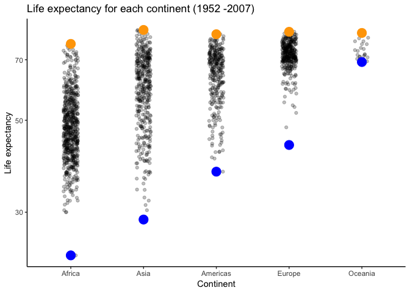

hw05-tsmith93
================
Thomas Smith
2018-10-15

Assignment structure
--------------------

1.  Overview
2.  Loading packages
3.  Factor management
4.  File I/O
5.  Visualization design
6.  Writing figures to file

### 1. Overview

For this assignment, we will be exploring factors, file input/output, visualization design, and writing figures to files. In order to explore and highlight important aspects of each component, we will walk through examples together.

### 2. Loading packages

If you haven't already done so, download both gapminder and tidyverse using `install.packages()`

Next load gapminder, tidyverse and knitr:

``` r
#suppressPackageStartupMessages stops unecessary messages from popping up
suppressPackageStartupMessages(library(tidyverse))
suppressPackageStartupMessages(library(gapminder))
suppressPackageStartupMessages(library(knitr))
suppressPackageStartupMessages(library(plotly))
```

### 3. Factor management

#### 3.1 Dropping unused levels

##### Create an unused level

For the first part of this assignment, we are going to practice dropping a specific factor from a dataset. As an example, we will be using the gapminder dataset. First, lets see what type of variables are factors in this dataset.

``` r
#we will used sapply to return a matrix of variable classes in gapminder
sapply(gapminder, class) %>% 
  kable()
```

|           | x       |
|-----------|:--------|
| country   | factor  |
| continent | factor  |
| year      | integer |
| lifeExp   | numeric |
| pop       | integer |
| gdpPercap | numeric |

This table shows that both country and continent are factors. We can also use the structure function to assess what are factors in this dataset.

``` r
str(gapminder)
```

    ## Classes 'tbl_df', 'tbl' and 'data.frame':    1704 obs. of  6 variables:
    ##  $ country  : Factor w/ 142 levels "Afghanistan",..: 1 1 1 1 1 1 1 1 1 1 ...
    ##  $ continent: Factor w/ 5 levels "Africa","Americas",..: 3 3 3 3 3 3 3 3 3 3 ...
    ##  $ year     : int  1952 1957 1962 1967 1972 1977 1982 1987 1992 1997 ...
    ##  $ lifeExp  : num  28.8 30.3 32 34 36.1 ...
    ##  $ pop      : int  8425333 9240934 10267083 11537966 13079460 14880372 12881816 13867957 16317921 22227415 ...
    ##  $ gdpPercap: num  779 821 853 836 740 ...

Again, it is clear that both country and continent are factors. Lets focus on continent

We will use `filter()` to remove all data for Oceania.

``` r
#create an object `no_oceania`, which will be the gapminder dataset with Oceania data removed.
no_oceania <- gapminder %>% 
  filter(continent != "Oceania") 
```

To see if data for Oceania was dropped, we will compare the number of rows in the gapminder dataset, the number of rows for Oceania, and the number of rows in the the no\_oceania dataframe.

``` r
nrow(gapminder)
```

    ## [1] 1704

``` r
nrow(gapminder[gapminder$continent == "Oceania",])
```

    ## [1] 24

``` r
nrow(no_oceania)
```

    ## [1] 1680

The total number of rows in gapminder is 1704, and Oceania provides 24 rows, therfore 1680 rows in no\_ocean confirms that data for Oceania has been removed.

Let's look at the structure of `no_oceania` to see if there are any unused levels in the dataset. Specifically, we will be looking at the number of levels for continent.

``` r
str(no_oceania)
```

    ## Classes 'tbl_df', 'tbl' and 'data.frame':    1680 obs. of  6 variables:
    ##  $ country  : Factor w/ 142 levels "Afghanistan",..: 1 1 1 1 1 1 1 1 1 1 ...
    ##  $ continent: Factor w/ 5 levels "Africa","Americas",..: 3 3 3 3 3 3 3 3 3 3 ...
    ##  $ year     : int  1952 1957 1962 1967 1972 1977 1982 1987 1992 1997 ...
    ##  $ lifeExp  : num  28.8 30.3 32 34 36.1 ...
    ##  $ pop      : int  8425333 9240934 10267083 11537966 13079460 14880372 12881816 13867957 16317921 22227415 ...
    ##  $ gdpPercap: num  779 821 853 836 740 ...

It appears that there are still 5 levels for the continent variable. Lets use a figure to see what is going on.

``` r
#plot continents for no_oceania
ggplot(no_oceania, aes(continent)) +
  geom_bar() +
  #FALSE will plot all existing levels, even if they are empty
  scale_x_discrete(drop = FALSE) + 
  #lets give the titles nice looking names
  ylab("Number of countries") +
  xlab("Continent") +
  ggtitle("Country count per continent") +
  #add the classic theme
  theme_classic()
```


It is very clear to see that Oceania is present as an unused level.

Alternatively to the process just described, we can also easily use fct\_count() to see if Oceania is an unused level in `no_oceania`:

``` r
#fct_count will count all the factors
fct_count(no_oceania$continent) %>% 
#lets present it in a nice table with kable()  
  kable()
```

| f        |    n|
|:---------|----:|
| Africa   |  624|
| Americas |  300|
| Asia     |  396|
| Europe   |  360|
| Oceania  |    0|

##### Drop unused level

Now that Oceania has been identified as an unused, lets use the `droplevels()` function to drop it!

``` r
#make a new object that excludes unused levels
oceania_gone <- droplevels(no_oceania)
```

Now lets check to see whether it has actually been dropped with use graphical representation.

``` r
#again we will plot a bar graph of continents
ggplot(oceania_gone, aes(continent)) +
  geom_bar() +
#again FALSE will plot all existing levels, even if they are empty
  scale_x_discrete(drop = FALSE) +
#add cleaner titles  
  ylab("Number of countries") +
  xlab("Continent") +
  ggtitle("Country count per continent") +
  theme_classic()
```


Ta da! Oceania is no longer present as an unused level.

Again, we can double check with `fct_count()`:

``` r
fct_count(oceania_gone$continent) %>% 
#present factor data in a nice table!  
  kable()
```

| f        |    n|
|:---------|----:|
| Africa   |  624|
| Americas |  300|
| Asia     |  396|
| Europe   |  360|

There you go, the unused level "Oceania" is confirmed to be gone.

#### 3.2 Reorder factors

##### Look at default order

In this section, we will use the packages `forcats` and `ggplot2` (part of tidyverse) in order to reorder levels in the gapminder dataset so that data can be displayed in a more user friendly, or user specific, way.

For this example, we will look at life expectancy in each continent. Specifically, we will do a jitter plot and have the minimum and maximum values highlighted.

``` r
#plot life expectancies for each continent
ggplot(gapminder, aes(x = continent, y = lifeExp)) +
#add a log10 scale to the y axis
  scale_y_log10() +
#use jitter to understand the data spread, change the aesthetics of the jitter points
  geom_jitter(position = position_jitter(width = 0.1, height = 0), alpha = 1/4) +
#plot all of the minimum values with blue points  
  stat_summary(fun.y = min, colour = "blue", geom = "point", size = 5) +
#plot all of the minimum values with orange points   
  stat_summary(fun.y = max, colour = "orange", geom = "point", size = 5) +
#give the labels nice looking titles  
  ylab("Life expectancy") +
  xlab("Continent") +
  ggtitle("Life expectancy for each continent (1952 - 2007)") +
#specify the theme of figure, add white background, remove grid, make the axis lines black  
  theme(panel.grid.major = element_blank(), panel.grid.minor = element_blank(), panel.background = element_blank(),
  axis.line = element_line(colour = "black"))
```


In this figure, we can see that the continents are ordered alphabetically. But what if we want them ordered differently?

##### Reorder

Factors can be reorder so that data is displayed in a more desired way. Here are a couple examples!

Let's try to order the continents based on the ascending minimum values for life expectancy.

``` r
#lets make a new object with continent and life expectancy with factors re-ordered basd on minimum life expectancy  
gap_lifeExp_min_asc <- gapminder %>% 
  mutate(continent = fct_reorder(continent, lifeExp, .fun = min))

#lets plot this new object the same way we plotted the last figure
ggplot(gap_lifeExp_min_asc, aes(x = continent, y = lifeExp)) +
#add log10 scale  
  scale_y_log10() +
#use jitter to display spread  
  geom_jitter(position = position_jitter(width = 0.1, height = 0), alpha = 1/4) +
#highlight minimum and maximum values  
  stat_summary(fun.y = min, colour = "blue", geom = "point", size = 5) +
  stat_summary(fun.y = max, colour = "orange", geom = "point", size = 5) +
#add nice looking titles  
  ylab("Life expectancy") +
  xlab("Continent") +
  ggtitle("Life expectancy for each continent (1952 -2007)") +
#change them so background is blank and white, with black axes  
  theme(panel.grid.major = element_blank(), panel.grid.minor = element_blank(), panel.background = element_blank(),
  axis.line = element_line(colour = "black"))
```



Look at that! It is very clear Africa had the lowest minimum life expectancy and Oceania had the highest minimum life expectancy. Lets try switching that order so that it is done by descending minimum values.

``` r
#assign the reorder factor data to a new object
gap_lifeExp_min_des <- gapminder %>% 
  mutate(continent = fct_reorder(continent, lifeExp, .fun = min, .desc = TRUE))

#plot the same figure for consistency
ggplot(gap_lifeExp_min_des, aes(x = continent, y = lifeExp)) +
#add log10 scale  
  scale_y_log10() +
#use jitter so all dat points are seen - spread is clearly shown!  
  geom_jitter(position = position_jitter(width = 0.1, height = 0), alpha = 1/4) +
#minimum and maximum life expectancy valeus highlighted  
  stat_summary(fun.y = min, colour = "blue", geom = "point", size = 5) +
  stat_summary(fun.y = max, colour = "orange", geom = "point", size = 5) +
#clean looking titles  
  ylab("Life expectancy") +
  xlab("Continent") +
  ggtitle("Life expectancy for each continent (1952 - 2007)") +
#white background and black axes -look at past figures for more in depth explanation :)  
  theme(panel.grid.major = element_blank(), panel.grid.minor = element_blank(), panel.background = element_blank(),
  axis.line = element_line(colour = "black"))
```


There we go, same information shown as the last figure, but the order of factors has been reversed!

### Part 2: File I/O

In this section, we are going to see what happens when we save data to a csv file and reopen that csv file. Specifically, we will look to see if reordering of factors is maintained. First lets make a new data object.

#### 2.1 Make new object

``` r
#lets make a new object with data from Asia only
asia <- gapminder %>% 
  filter(continent == "Asia") 

#plot life expectancies for each country
asia %>% 
  ggplot(aes(country, lifeExp)) +
  geom_point() +
#this will flip axes so labels are read more easily 
  coord_flip() +
#give the figure nice titles  
  labs(title = "Life expectancy in Asia (1957-2007)",
       x = "Life expectancy (years)",
       y = "Country") +
#give figure a nice look  
  theme_light()
```


The figure looks a little cluttered. We will reorder factors to make it look nicer.

#### 2.2 Reorder factors

``` r
#new object with factors (countries in this case) ordered by median
asia_reorder <- asia %>% 
mutate(country = fct_reorder(country, lifeExp, .fun = median))

asia_reorder %>% 
#plot country and life expectancy  
  ggplot(aes(country, lifeExp)) +
  geom_point() +
#this will flip axes so labels are read more easily   
  coord_flip() + 
#ncie to read titles  
  labs(title = "Life expectancy in Asia (1957-2007)",
       x = "Life expectancy (years)",
       y = "Country") +
#give plot a nice lookign theme  
  theme_light()
```


There you can see the figure is much easier to look at, with Afghanistan having the lowest median life expectanyc and Japan havign the highest meanlife expectancy.

#### 2.3 Save data to csv and read the same csv

For this, we will use `write_csv()` and `gap_read()`

``` r
write_csv(asia_reorder, "asia_reorder.csv")

#Reading new data set back in
(gap_read <- read_csv("asia_reorder.csv"))
```

    ## Parsed with column specification:
    ## cols(
    ##   country = col_character(),
    ##   continent = col_character(),
    ##   year = col_integer(),
    ##   lifeExp = col_double(),
    ##   pop = col_integer(),
    ##   gdpPercap = col_double()
    ## )

    ## # A tibble: 396 x 6
    ##    country     continent  year lifeExp      pop gdpPercap
    ##    <chr>       <chr>     <int>   <dbl>    <int>     <dbl>
    ##  1 Afghanistan Asia       1952    28.8  8425333      779.
    ##  2 Afghanistan Asia       1957    30.3  9240934      821.
    ##  3 Afghanistan Asia       1962    32.0 10267083      853.
    ##  4 Afghanistan Asia       1967    34.0 11537966      836.
    ##  5 Afghanistan Asia       1972    36.1 13079460      740.
    ##  6 Afghanistan Asia       1977    38.4 14880372      786.
    ##  7 Afghanistan Asia       1982    39.9 12881816      978.
    ##  8 Afghanistan Asia       1987    40.8 13867957      852.
    ##  9 Afghanistan Asia       1992    41.7 16317921      649.
    ## 10 Afghanistan Asia       1997    41.8 22227415      635.
    ## # ... with 386 more rows

``` r
#We will display this data using the same code as before
(gap_read %>% 
  ggplot(aes(country, lifeExp)) +
  geom_point() +
#make the labels on axes easier to read
  coord_flip() + 
#give nice axis titles    
  labs(title = "Life expectancy in Asia (1957-2007)",
       x = "Life expectancy (years)",
       y = "Country") +
  theme_light())
```


It is very clear that the reorderign of factors is not maintained when you save a csv.

#### 2.4 Save to RDS and read RDS

Here we will use `saveRDS` to save asia\_reorder to RDS. Immediately after we will read the RDS. Finally, we will compare the two to see if they are identical.

``` r
#have object, and include pathway to where you want to export
saveRDS(asia_reorder, '/Users/thomassmith/Documents/MSc courses/STAT 545A/Assignment/hw05-tsmith93/hw05-tsmith93/asia_reorder.rds')

#assign RDS data to an object. Specify the file pathway
asia_reorder_RDS <- readRDS('/Users/thomassmith/Documents/MSc courses/STAT 545A/Assignment/hw05-tsmith93/hw05-tsmith93/asia_reorder.rds') 

#look to see if the files are the same
identical(asia_reorder, asia_reorder_RDS) 
```

    ## [1] TRUE

Look at that, the exported RDS is identical the imported RDS.

### Part 3: Visualization design

For this section, we will getting more practice with plot visualization. Specifically, we will be using both ggplot2, as well as plotly. This will allow us to make comparisons between the two data visualization packages.

#### 3.1 Basic plots

As an example, we will practice with the `gapminder` dataset, looking at GDP and life expectancy for Scandinavian countries.

``` r
#Create an object called 'scandinavia' to store the desired data 
(scandinavia <- 
  #call upon the gapminder dataset
  gapminder %>%
  #Filter so that we are only using Canada, Russia, Japan, and United States
  filter(country=="Finland" | country == "Norway" | country == "Sweden" | country == "Iceland" | country == "Denmark") %>% 
  #Mae table cleaner by rounding the life expectancies off the nearest integer
  mutate(lifeExp = round(lifeExp, 0)) %>% 
  #Select the columns country, year and life expectancy
  select(country, year, lifeExp, gdpPercap))
```

    ## # A tibble: 60 x 4
    ##    country  year lifeExp gdpPercap
    ##    <fct>   <int>   <dbl>     <dbl>
    ##  1 Denmark  1952      71     9692.
    ##  2 Denmark  1957      72    11100.
    ##  3 Denmark  1962      72    13583.
    ##  4 Denmark  1967      73    15937.
    ##  5 Denmark  1972      73    18866.
    ##  6 Denmark  1977      75    20423.
    ##  7 Denmark  1982      75    21688.
    ##  8 Denmark  1987      75    25116.
    ##  9 Denmark  1992      75    26407.
    ## 10 Denmark  1997      76    29804.
    ## # ... with 50 more rows

Lets first make a basic plot of life expectancy over time for these countries:

``` r
#call upon object 'scandinavia'
(scandinavia %>% 
  #use ggplot with 'year' and 'lifeExp' as x and y
  ggplot(aes(year, lifeExp)) +
  #add a scatterplot with point colour specified by country
  geom_point(aes(colour= country)) +
  #add a title
  ggtitle("Life Expectancies in Scandinavia (1952-2007)") +
  geom_smooth(method = lm, se = FALSE, aes(colour = country)))
```

 I think we can make the figure look much cleaner with a few changes to the code.

``` r
#call upon object 'scandinavia'
scandinavia %>% 
  #use ggplot with 'year' and 'lifeExp' as x and y
  ggplot(aes(year, lifeExp)) +
  #add a scatterplot with point colour specified by country
  geom_point(aes(colour= country)) +
  #add a title
  ggtitle("Life Expectancies in Scandinavia (1952-2007)") +
  geom_smooth(method = lm, se = FALSE, aes(colour = country)) +
  #add x and y labels
  xlab("Year") +
  ylab("Life expectancy (years)") +
  #clean up the aesthetic of the plot!
  theme(panel.grid.major = element_blank(), panel.grid.minor = element_blank(), panel.background = element_blank(),
  axis.line = element_line(colour = "black")) 
```


Wow, that thing is way nicer to look at! Lets do the same plot, but this time use GDP per capita on the y axis.

``` r
#call upon object 'scandinavia'
scandinavia_plot <- scandinavia %>% 
  #use ggplot with 'year' and 'lifeExp' as x and y
  ggplot(aes(year, gdpPercap)) +
  #add a scatterplot with point colour specified by country
  geom_point(aes(colour= country)) +
  #add a title
  ggtitle("GDP per capita in Scandinavia (1952-2007)") +
  geom_smooth(method = lm, se = FALSE, aes(colour = country)) +
  #add x and y labels
  xlab("Year") +
  ylab("GDP per capita") +
  #clean up the aesthetic of the plot!
  theme(panel.grid.major = element_blank(), panel.grid.minor = element_blank(), panel.background = element_blank(),
  axis.line = element_line(colour = "black")) 

#display the plot
scandinavia_plot
```


Wow, another great looking plot. But I think we can display the data from these two plots in one figure. To do this, we will have to use `plotly` package, which we loaded at the very beginning of this file!

#### 3.2 plotly figures

``` r
#select scandinavia data
plot_ly(scandinavia, 
#assign a variable to the x, y, and z axes        
        x = ~year, 
        y = ~lifeExp, 
        z = ~gdpPercap,
#select the type of plotly plot
        type = "scatter3d",
#specify the type of markers and look of them
        mode = "markers",
        opacity = 0.2)
```

<!--html_preserve-->

<script type="application/json" data-for="htmlwidget-fa48223c18bf86c82798">{"x":{"visdat":{"a2b13900d05":["function () ","plotlyVisDat"]},"cur_data":"a2b13900d05","attrs":{"a2b13900d05":{"x":{},"y":{},"z":{},"mode":"markers","opacity":0.2,"alpha_stroke":1,"sizes":[10,100],"spans":[1,20],"type":"scatter3d"}},"layout":{"margin":{"b":40,"l":60,"t":25,"r":10},"scene":{"xaxis":{"title":"year"},"yaxis":{"title":"lifeExp"},"zaxis":{"title":"gdpPercap"}},"hovermode":"closest","showlegend":false},"source":"A","config":{"modeBarButtonsToAdd":[{"name":"Collaborate","icon":{"width":1000,"ascent":500,"descent":-50,"path":"M487 375c7-10 9-23 5-36l-79-259c-3-12-11-23-22-31-11-8-22-12-35-12l-263 0c-15 0-29 5-43 15-13 10-23 23-28 37-5 13-5 25-1 37 0 0 0 3 1 7 1 5 1 8 1 11 0 2 0 4-1 6 0 3-1 5-1 6 1 2 2 4 3 6 1 2 2 4 4 6 2 3 4 5 5 7 5 7 9 16 13 26 4 10 7 19 9 26 0 2 0 5 0 9-1 4-1 6 0 8 0 2 2 5 4 8 3 3 5 5 5 7 4 6 8 15 12 26 4 11 7 19 7 26 1 1 0 4 0 9-1 4-1 7 0 8 1 2 3 5 6 8 4 4 6 6 6 7 4 5 8 13 13 24 4 11 7 20 7 28 1 1 0 4 0 7-1 3-1 6-1 7 0 2 1 4 3 6 1 1 3 4 5 6 2 3 3 5 5 6 1 2 3 5 4 9 2 3 3 7 5 10 1 3 2 6 4 10 2 4 4 7 6 9 2 3 4 5 7 7 3 2 7 3 11 3 3 0 8 0 13-1l0-1c7 2 12 2 14 2l218 0c14 0 25-5 32-16 8-10 10-23 6-37l-79-259c-7-22-13-37-20-43-7-7-19-10-37-10l-248 0c-5 0-9-2-11-5-2-3-2-7 0-12 4-13 18-20 41-20l264 0c5 0 10 2 16 5 5 3 8 6 10 11l85 282c2 5 2 10 2 17 7-3 13-7 17-13z m-304 0c-1-3-1-5 0-7 1-1 3-2 6-2l174 0c2 0 4 1 7 2 2 2 4 4 5 7l6 18c0 3 0 5-1 7-1 1-3 2-6 2l-173 0c-3 0-5-1-8-2-2-2-4-4-4-7z m-24-73c-1-3-1-5 0-7 2-2 3-2 6-2l174 0c2 0 5 0 7 2 3 2 4 4 5 7l6 18c1 2 0 5-1 6-1 2-3 3-5 3l-174 0c-3 0-5-1-7-3-3-1-4-4-5-6z"},"click":"function(gd) { \n        // is this being viewed in RStudio?\n        if (location.search == '?viewer_pane=1') {\n          alert('To learn about plotly for collaboration, visit:\\n https://cpsievert.github.io/plotly_book/plot-ly-for-collaboration.html');\n        } else {\n          window.open('https://cpsievert.github.io/plotly_book/plot-ly-for-collaboration.html', '_blank');\n        }\n      }"}],"cloud":false},"data":[{"x":[1952,1957,1962,1967,1972,1977,1982,1987,1992,1997,2002,2007,1952,1957,1962,1967,1972,1977,1982,1987,1992,1997,2002,2007,1952,1957,1962,1967,1972,1977,1982,1987,1992,1997,2002,2007,1952,1957,1962,1967,1972,1977,1982,1987,1992,1997,2002,2007,1952,1957,1962,1967,1972,1977,1982,1987,1992,1997,2002,2007],"y":[71,72,72,73,73,75,75,75,75,76,77,78,67,67,69,70,71,73,75,75,76,77,78,79,72,73,74,74,74,76,77,77,79,79,80,82,73,73,73,74,74,75,76,76,77,78,79,80,72,72,73,74,75,75,76,77,78,79,80,81],"z":[9692.385245,11099.65935,13583.31351,15937.21123,18866.20721,20422.9015,21688.04048,25116.17581,26406.73985,29804.34567,32166.50006,35278.41874,6424.519071,7545.415386,9371.842561,10921.63626,14358.8759,15605.42283,18533.15761,21141.01223,20647.16499,23723.9502,28204.59057,33207.0844,7267.688428,9244.001412,10350.15906,13319.89568,15798.06362,19654.96247,23269.6075,26923.20628,25144.39201,28061.09966,31163.20196,36180.78919,10095.42172,11653.97304,13450.40151,16361.87647,18965.05551,23311.34939,26298.63531,31540.9748,33965.66115,41283.16433,44683.97525,49357.19017,8527.844662,9911.878226,12329.44192,15258.29697,17832.02464,18855.72521,20667.38125,23586.92927,23880.01683,25266.59499,29341.63093,33859.74835],"mode":"markers","opacity":0.2,"type":"scatter3d","marker":{"color":"rgba(31,119,180,1)","line":{"color":"rgba(31,119,180,1)"}},"error_y":{"color":"rgba(31,119,180,1)"},"error_x":{"color":"rgba(31,119,180,1)"},"line":{"color":"rgba(31,119,180,1)"},"frame":null}],"highlight":{"on":"plotly_click","persistent":false,"dynamic":false,"selectize":false,"opacityDim":0.2,"selected":{"opacity":1},"debounce":0},"base_url":"https://plot.ly"},"evals":["config.modeBarButtonsToAdd.0.click"],"jsHooks":[]}</script>
<!--/html_preserve-->
What an efficient way of putting all the data together. Try moving the figure around with your mouse! Its interactive!

#### 3.3 Convert a ggplot to plotly

``` r
#Converting previous plot to plotly figure
(scandinavia_plotly <- ggplotly(scandinavia_plot))
```

<!--html_preserve-->

<script type="application/json" data-for="htmlwidget-a9909999e8cb82d0aa04">{"x":{"data":[{"x":[1952,1957,1962,1967,1972,1977,1982,1987,1992,1997,2002,2007],"y":[9692.385245,11099.65935,13583.31351,15937.21123,18866.20721,20422.9015,21688.04048,25116.17581,26406.73985,29804.34567,32166.50006,35278.41874],"text":["country: Denmark<br />year: 1952<br />gdpPercap:  9692.385","country: Denmark<br />year: 1957<br />gdpPercap: 11099.659","country: Denmark<br />year: 1962<br />gdpPercap: 13583.314","country: Denmark<br />year: 1967<br />gdpPercap: 15937.211","country: Denmark<br />year: 1972<br />gdpPercap: 18866.207","country: Denmark<br />year: 1977<br />gdpPercap: 20422.901","country: Denmark<br />year: 1982<br />gdpPercap: 21688.040","country: Denmark<br />year: 1987<br />gdpPercap: 25116.176","country: Denmark<br />year: 1992<br />gdpPercap: 26406.740","country: Denmark<br />year: 1997<br />gdpPercap: 29804.346","country: Denmark<br />year: 2002<br />gdpPercap: 32166.500","country: Denmark<br />year: 2007<br />gdpPercap: 35278.419"],"type":"scatter","mode":"markers","marker":{"autocolorscale":false,"color":"rgba(248,118,109,1)","opacity":1,"size":5.66929133858268,"symbol":"circle","line":{"width":1.88976377952756,"color":"rgba(248,118,109,1)"}},"hoveron":"points","name":"Denmark","legendgroup":"Denmark","showlegend":true,"xaxis":"x","yaxis":"y","hoverinfo":"text","frame":null},{"x":[1952,1957,1962,1967,1972,1977,1982,1987,1992,1997,2002,2007],"y":[6424.519071,7545.415386,9371.842561,10921.63626,14358.8759,15605.42283,18533.15761,21141.01223,20647.16499,23723.9502,28204.59057,33207.0844],"text":["country: Finland<br />year: 1952<br />gdpPercap:  6424.519","country: Finland<br />year: 1957<br />gdpPercap:  7545.415","country: Finland<br />year: 1962<br />gdpPercap:  9371.843","country: Finland<br />year: 1967<br />gdpPercap: 10921.636","country: Finland<br />year: 1972<br />gdpPercap: 14358.876","country: Finland<br />year: 1977<br />gdpPercap: 15605.423","country: Finland<br />year: 1982<br />gdpPercap: 18533.158","country: Finland<br />year: 1987<br />gdpPercap: 21141.012","country: Finland<br />year: 1992<br />gdpPercap: 20647.165","country: Finland<br />year: 1997<br />gdpPercap: 23723.950","country: Finland<br />year: 2002<br />gdpPercap: 28204.591","country: Finland<br />year: 2007<br />gdpPercap: 33207.084"],"type":"scatter","mode":"markers","marker":{"autocolorscale":false,"color":"rgba(163,165,0,1)","opacity":1,"size":5.66929133858268,"symbol":"circle","line":{"width":1.88976377952756,"color":"rgba(163,165,0,1)"}},"hoveron":"points","name":"Finland","legendgroup":"Finland","showlegend":true,"xaxis":"x","yaxis":"y","hoverinfo":"text","frame":null},{"x":[1952,1957,1962,1967,1972,1977,1982,1987,1992,1997,2002,2007],"y":[7267.688428,9244.001412,10350.15906,13319.89568,15798.06362,19654.96247,23269.6075,26923.20628,25144.39201,28061.09966,31163.20196,36180.78919],"text":["country: Iceland<br />year: 1952<br />gdpPercap:  7267.688","country: Iceland<br />year: 1957<br />gdpPercap:  9244.001","country: Iceland<br />year: 1962<br />gdpPercap: 10350.159","country: Iceland<br />year: 1967<br />gdpPercap: 13319.896","country: Iceland<br />year: 1972<br />gdpPercap: 15798.064","country: Iceland<br />year: 1977<br />gdpPercap: 19654.962","country: Iceland<br />year: 1982<br />gdpPercap: 23269.607","country: Iceland<br />year: 1987<br />gdpPercap: 26923.206","country: Iceland<br />year: 1992<br />gdpPercap: 25144.392","country: Iceland<br />year: 1997<br />gdpPercap: 28061.100","country: Iceland<br />year: 2002<br />gdpPercap: 31163.202","country: Iceland<br />year: 2007<br />gdpPercap: 36180.789"],"type":"scatter","mode":"markers","marker":{"autocolorscale":false,"color":"rgba(0,191,125,1)","opacity":1,"size":5.66929133858268,"symbol":"circle","line":{"width":1.88976377952756,"color":"rgba(0,191,125,1)"}},"hoveron":"points","name":"Iceland","legendgroup":"Iceland","showlegend":true,"xaxis":"x","yaxis":"y","hoverinfo":"text","frame":null},{"x":[1952,1957,1962,1967,1972,1977,1982,1987,1992,1997,2002,2007],"y":[10095.42172,11653.97304,13450.40151,16361.87647,18965.05551,23311.34939,26298.63531,31540.9748,33965.66115,41283.16433,44683.97525,49357.19017],"text":["country: Norway<br />year: 1952<br />gdpPercap: 10095.422","country: Norway<br />year: 1957<br />gdpPercap: 11653.973","country: Norway<br />year: 1962<br />gdpPercap: 13450.402","country: Norway<br />year: 1967<br />gdpPercap: 16361.876","country: Norway<br />year: 1972<br />gdpPercap: 18965.056","country: Norway<br />year: 1977<br />gdpPercap: 23311.349","country: Norway<br />year: 1982<br />gdpPercap: 26298.635","country: Norway<br />year: 1987<br />gdpPercap: 31540.975","country: Norway<br />year: 1992<br />gdpPercap: 33965.661","country: Norway<br />year: 1997<br />gdpPercap: 41283.164","country: Norway<br />year: 2002<br />gdpPercap: 44683.975","country: Norway<br />year: 2007<br />gdpPercap: 49357.190"],"type":"scatter","mode":"markers","marker":{"autocolorscale":false,"color":"rgba(0,176,246,1)","opacity":1,"size":5.66929133858268,"symbol":"circle","line":{"width":1.88976377952756,"color":"rgba(0,176,246,1)"}},"hoveron":"points","name":"Norway","legendgroup":"Norway","showlegend":true,"xaxis":"x","yaxis":"y","hoverinfo":"text","frame":null},{"x":[1952,1957,1962,1967,1972,1977,1982,1987,1992,1997,2002,2007],"y":[8527.844662,9911.878226,12329.44192,15258.29697,17832.02464,18855.72521,20667.38125,23586.92927,23880.01683,25266.59499,29341.63093,33859.74835],"text":["country: Sweden<br />year: 1952<br />gdpPercap:  8527.845","country: Sweden<br />year: 1957<br />gdpPercap:  9911.878","country: Sweden<br />year: 1962<br />gdpPercap: 12329.442","country: Sweden<br />year: 1967<br />gdpPercap: 15258.297","country: Sweden<br />year: 1972<br />gdpPercap: 17832.025","country: Sweden<br />year: 1977<br />gdpPercap: 18855.725","country: Sweden<br />year: 1982<br />gdpPercap: 20667.381","country: Sweden<br />year: 1987<br />gdpPercap: 23586.929","country: Sweden<br />year: 1992<br />gdpPercap: 23880.017","country: Sweden<br />year: 1997<br />gdpPercap: 25266.595","country: Sweden<br />year: 2002<br />gdpPercap: 29341.631","country: Sweden<br />year: 2007<br />gdpPercap: 33859.748"],"type":"scatter","mode":"markers","marker":{"autocolorscale":false,"color":"rgba(231,107,243,1)","opacity":1,"size":5.66929133858268,"symbol":"circle","line":{"width":1.88976377952756,"color":"rgba(231,107,243,1)"}},"hoveron":"points","name":"Sweden","legendgroup":"Sweden","showlegend":true,"xaxis":"x","yaxis":"y","hoverinfo":"text","frame":null},{"x":[1952,1952.69620253165,1953.39240506329,1954.08860759494,1954.78481012658,1955.48101265823,1956.17721518987,1956.87341772152,1957.56962025316,1958.26582278481,1958.96202531646,1959.6582278481,1960.35443037975,1961.05063291139,1961.74683544304,1962.44303797468,1963.13924050633,1963.83544303797,1964.53164556962,1965.22784810127,1965.92405063291,1966.62025316456,1967.3164556962,1968.01265822785,1968.70886075949,1969.40506329114,1970.10126582278,1970.79746835443,1971.49367088608,1972.18987341772,1972.88607594937,1973.58227848101,1974.27848101266,1974.9746835443,1975.67088607595,1976.36708860759,1977.06329113924,1977.75949367089,1978.45569620253,1979.15189873418,1979.84810126582,1980.54430379747,1981.24050632911,1981.93670886076,1982.63291139241,1983.32911392405,1984.0253164557,1984.72151898734,1985.41772151899,1986.11392405063,1986.81012658228,1987.50632911392,1988.20253164557,1988.89873417722,1989.59493670886,1990.29113924051,1990.98734177215,1991.6835443038,1992.37974683544,1993.07594936709,1993.77215189873,1994.46835443038,1995.16455696203,1995.86075949367,1996.55696202532,1997.25316455696,1997.94936708861,1998.64556962025,1999.3417721519,2000.03797468354,2000.73417721519,2001.43037974684,2002.12658227848,2002.82278481013,2003.51898734177,2004.21518987342,2004.91139240506,2005.60759493671,2006.30379746835,2007],"y":[9038.02012185892,9357.8632804933,9677.70643912756,9997.54959776206,10317.3927563963,10637.2359150308,10957.0790736651,11276.9222322995,11596.765390934,11916.6085495682,12236.4517082026,12556.294866837,12876.1380254714,13195.9811841057,13515.8243427401,13835.6675013745,14155.5106600089,14475.3538186433,14795.1969772776,15115.040135912,15434.8832945463,15754.7264531808,16074.5696118152,16394.4127704494,16714.2559290839,17034.0990877182,17353.9422463527,17673.7854049869,17993.6285636213,18313.4717222558,18633.3148808901,18953.1580395245,19273.0011981588,19592.8443567932,19912.6875154276,20232.530674062,20552.3738326964,20872.2169913307,21192.0601499651,21511.9033085994,21831.7464672339,22151.5896258681,22471.4327845026,22791.275943137,23111.1191017713,23430.9622604058,23750.80541904,24070.6485776744,24390.4917363088,24710.3348949432,25030.1780535775,25350.0212122119,25669.8643708463,25989.7075294807,26309.5506881151,26629.3938467494,26949.2370053838,27269.0801640181,27588.9233226526,27908.766481287,28228.6096399212,28548.4527985557,28868.29595719,29188.1391158245,29507.9822744587,29827.8254330931,30147.6685917276,30467.5117503619,30787.3549089963,31107.1980676306,31427.041226265,31746.8843848994,32066.7275435338,32386.5707021682,32706.4138608025,33026.2570194369,33346.1001780712,33665.9433367057,33985.7864953399,34305.6296539744],"text":["country: Denmark<br />year: 1952.000<br />gdpPercap:  9038.020","country: Denmark<br />year: 1952.696<br />gdpPercap:  9357.863","country: Denmark<br />year: 1953.392<br />gdpPercap:  9677.706","country: Denmark<br />year: 1954.089<br />gdpPercap:  9997.550","country: Denmark<br />year: 1954.785<br />gdpPercap: 10317.393","country: Denmark<br />year: 1955.481<br />gdpPercap: 10637.236","country: Denmark<br />year: 1956.177<br />gdpPercap: 10957.079","country: Denmark<br />year: 1956.873<br />gdpPercap: 11276.922","country: Denmark<br />year: 1957.570<br />gdpPercap: 11596.765","country: Denmark<br />year: 1958.266<br />gdpPercap: 11916.609","country: Denmark<br />year: 1958.962<br />gdpPercap: 12236.452","country: Denmark<br />year: 1959.658<br />gdpPercap: 12556.295","country: Denmark<br />year: 1960.354<br />gdpPercap: 12876.138","country: Denmark<br />year: 1961.051<br />gdpPercap: 13195.981","country: Denmark<br />year: 1961.747<br />gdpPercap: 13515.824","country: Denmark<br />year: 1962.443<br />gdpPercap: 13835.668","country: Denmark<br />year: 1963.139<br />gdpPercap: 14155.511","country: Denmark<br />year: 1963.835<br />gdpPercap: 14475.354","country: Denmark<br />year: 1964.532<br />gdpPercap: 14795.197","country: Denmark<br />year: 1965.228<br />gdpPercap: 15115.040","country: Denmark<br />year: 1965.924<br />gdpPercap: 15434.883","country: Denmark<br />year: 1966.620<br />gdpPercap: 15754.726","country: Denmark<br />year: 1967.316<br />gdpPercap: 16074.570","country: Denmark<br />year: 1968.013<br />gdpPercap: 16394.413","country: Denmark<br />year: 1968.709<br />gdpPercap: 16714.256","country: Denmark<br />year: 1969.405<br />gdpPercap: 17034.099","country: Denmark<br />year: 1970.101<br />gdpPercap: 17353.942","country: Denmark<br />year: 1970.797<br />gdpPercap: 17673.785","country: Denmark<br />year: 1971.494<br />gdpPercap: 17993.629","country: Denmark<br />year: 1972.190<br />gdpPercap: 18313.472","country: Denmark<br />year: 1972.886<br />gdpPercap: 18633.315","country: Denmark<br />year: 1973.582<br />gdpPercap: 18953.158","country: Denmark<br />year: 1974.278<br />gdpPercap: 19273.001","country: Denmark<br />year: 1974.975<br />gdpPercap: 19592.844","country: Denmark<br />year: 1975.671<br />gdpPercap: 19912.688","country: Denmark<br />year: 1976.367<br />gdpPercap: 20232.531","country: Denmark<br />year: 1977.063<br />gdpPercap: 20552.374","country: Denmark<br />year: 1977.759<br />gdpPercap: 20872.217","country: Denmark<br />year: 1978.456<br />gdpPercap: 21192.060","country: Denmark<br />year: 1979.152<br />gdpPercap: 21511.903","country: Denmark<br />year: 1979.848<br />gdpPercap: 21831.746","country: Denmark<br />year: 1980.544<br />gdpPercap: 22151.590","country: Denmark<br />year: 1981.241<br />gdpPercap: 22471.433","country: Denmark<br />year: 1981.937<br />gdpPercap: 22791.276","country: Denmark<br />year: 1982.633<br />gdpPercap: 23111.119","country: Denmark<br />year: 1983.329<br />gdpPercap: 23430.962","country: Denmark<br />year: 1984.025<br />gdpPercap: 23750.805","country: Denmark<br />year: 1984.722<br />gdpPercap: 24070.649","country: Denmark<br />year: 1985.418<br />gdpPercap: 24390.492","country: Denmark<br />year: 1986.114<br />gdpPercap: 24710.335","country: Denmark<br />year: 1986.810<br />gdpPercap: 25030.178","country: Denmark<br />year: 1987.506<br />gdpPercap: 25350.021","country: Denmark<br />year: 1988.203<br />gdpPercap: 25669.864","country: Denmark<br />year: 1988.899<br />gdpPercap: 25989.708","country: Denmark<br />year: 1989.595<br />gdpPercap: 26309.551","country: Denmark<br />year: 1990.291<br />gdpPercap: 26629.394","country: Denmark<br />year: 1990.987<br />gdpPercap: 26949.237","country: Denmark<br />year: 1991.684<br />gdpPercap: 27269.080","country: Denmark<br />year: 1992.380<br />gdpPercap: 27588.923","country: Denmark<br />year: 1993.076<br />gdpPercap: 27908.766","country: Denmark<br />year: 1993.772<br />gdpPercap: 28228.610","country: Denmark<br />year: 1994.468<br />gdpPercap: 28548.453","country: Denmark<br />year: 1995.165<br />gdpPercap: 28868.296","country: Denmark<br />year: 1995.861<br />gdpPercap: 29188.139","country: Denmark<br />year: 1996.557<br />gdpPercap: 29507.982","country: Denmark<br />year: 1997.253<br />gdpPercap: 29827.825","country: Denmark<br />year: 1997.949<br />gdpPercap: 30147.669","country: Denmark<br />year: 1998.646<br />gdpPercap: 30467.512","country: Denmark<br />year: 1999.342<br />gdpPercap: 30787.355","country: Denmark<br />year: 2000.038<br />gdpPercap: 31107.198","country: Denmark<br />year: 2000.734<br />gdpPercap: 31427.041","country: Denmark<br />year: 2001.430<br />gdpPercap: 31746.884","country: Denmark<br />year: 2002.127<br />gdpPercap: 32066.728","country: Denmark<br />year: 2002.823<br />gdpPercap: 32386.571","country: Denmark<br />year: 2003.519<br />gdpPercap: 32706.414","country: Denmark<br />year: 2004.215<br />gdpPercap: 33026.257","country: Denmark<br />year: 2004.911<br />gdpPercap: 33346.100","country: Denmark<br />year: 2005.608<br />gdpPercap: 33665.943","country: Denmark<br />year: 2006.304<br />gdpPercap: 33985.786","country: Denmark<br />year: 2007.000<br />gdpPercap: 34305.630"],"type":"scatter","mode":"lines","name":"Denmark","line":{"width":3.77952755905512,"color":"rgba(248,118,109,1)","dash":"solid"},"hoveron":"points","legendgroup":"Denmark","showlegend":false,"xaxis":"x","yaxis":"y","hoverinfo":"text","frame":null},{"x":[1952,1952.69620253165,1953.39240506329,1954.08860759494,1954.78481012658,1955.48101265823,1956.17721518987,1956.87341772152,1957.56962025316,1958.26582278481,1958.96202531646,1959.6582278481,1960.35443037975,1961.05063291139,1961.74683544304,1962.44303797468,1963.13924050633,1963.83544303797,1964.53164556962,1965.22784810127,1965.92405063291,1966.62025316456,1967.3164556962,1968.01265822785,1968.70886075949,1969.40506329114,1970.10126582278,1970.79746835443,1971.49367088608,1972.18987341772,1972.88607594937,1973.58227848101,1974.27848101266,1974.9746835443,1975.67088607595,1976.36708860759,1977.06329113924,1977.75949367089,1978.45569620253,1979.15189873418,1979.84810126582,1980.54430379747,1981.24050632911,1981.93670886076,1982.63291139241,1983.32911392405,1984.0253164557,1984.72151898734,1985.41772151899,1986.11392405063,1986.81012658228,1987.50632911392,1988.20253164557,1988.89873417722,1989.59493670886,1990.29113924051,1990.98734177215,1991.6835443038,1992.37974683544,1993.07594936709,1993.77215189873,1994.46835443038,1995.16455696203,1995.86075949367,1996.55696202532,1997.25316455696,1997.94936708861,1998.64556962025,1999.3417721519,2000.03797468354,2000.73417721519,2001.43037974684,2002.12658227848,2002.82278481013,2003.51898734177,2004.21518987342,2004.91139240506,2005.60759493671,2006.30379746835,2007],"y":[4917.81235641008,5235.68350352207,5553.55465063395,5871.42579774605,6189.29694485792,6507.16809196991,6825.0392390819,7142.91038619389,7460.78153330588,7778.65268041787,8096.52382752986,8414.39497464173,8732.26612175384,9050.13726886571,9368.0084159777,9685.87956308981,10003.7507102017,10321.6218573137,10639.4930044257,10957.3641515377,11275.2352986495,11593.1064457616,11910.9775928736,12228.8487399855,12546.7198870976,12864.5910342095,13182.4621813215,13500.3333284335,13818.2044755454,14136.0756226574,14453.9467697694,14771.8179168814,15089.6890639933,15407.5602111054,15725.4313582173,16043.3025053293,16361.1736524414,16679.0447995532,16996.9159466652,17314.7870937772,17632.6582408892,17950.5293880011,18268.4005351132,18586.2716822252,18904.142829337,19222.0139764491,19539.885123561,19857.756270673,20175.627417785,20493.498564897,20811.3697120089,21129.240859121,21447.112006233,21764.9831533448,22082.8543004569,22400.7254475688,22718.5965946808,23036.4677417928,23354.3388889048,23672.2100360168,23990.0811831288,24307.9523302407,24625.8234773526,24943.6946244647,25261.5657715766,25579.4369186886,25897.3080658007,26215.1792129126,26533.0503600246,26850.9215071365,27168.7926542485,27486.6638013604,27804.5349484725,28122.4060955845,28440.2772426964,28758.1483898085,29076.0195369204,29393.8906840323,29711.7618311443,30029.6329782563],"text":["country: Finland<br />year: 1952.000<br />gdpPercap:  4917.812","country: Finland<br />year: 1952.696<br />gdpPercap:  5235.684","country: Finland<br />year: 1953.392<br />gdpPercap:  5553.555","country: Finland<br />year: 1954.089<br />gdpPercap:  5871.426","country: Finland<br />year: 1954.785<br />gdpPercap:  6189.297","country: Finland<br />year: 1955.481<br />gdpPercap:  6507.168","country: Finland<br />year: 1956.177<br />gdpPercap:  6825.039","country: Finland<br />year: 1956.873<br />gdpPercap:  7142.910","country: Finland<br />year: 1957.570<br />gdpPercap:  7460.782","country: Finland<br />year: 1958.266<br />gdpPercap:  7778.653","country: Finland<br />year: 1958.962<br />gdpPercap:  8096.524","country: Finland<br />year: 1959.658<br />gdpPercap:  8414.395","country: Finland<br />year: 1960.354<br />gdpPercap:  8732.266","country: Finland<br />year: 1961.051<br />gdpPercap:  9050.137","country: Finland<br />year: 1961.747<br />gdpPercap:  9368.008","country: Finland<br />year: 1962.443<br />gdpPercap:  9685.880","country: Finland<br />year: 1963.139<br />gdpPercap: 10003.751","country: Finland<br />year: 1963.835<br />gdpPercap: 10321.622","country: Finland<br />year: 1964.532<br />gdpPercap: 10639.493","country: Finland<br />year: 1965.228<br />gdpPercap: 10957.364","country: Finland<br />year: 1965.924<br />gdpPercap: 11275.235","country: Finland<br />year: 1966.620<br />gdpPercap: 11593.106","country: Finland<br />year: 1967.316<br />gdpPercap: 11910.978","country: Finland<br />year: 1968.013<br />gdpPercap: 12228.849","country: Finland<br />year: 1968.709<br />gdpPercap: 12546.720","country: Finland<br />year: 1969.405<br />gdpPercap: 12864.591","country: Finland<br />year: 1970.101<br />gdpPercap: 13182.462","country: Finland<br />year: 1970.797<br />gdpPercap: 13500.333","country: Finland<br />year: 1971.494<br />gdpPercap: 13818.204","country: Finland<br />year: 1972.190<br />gdpPercap: 14136.076","country: Finland<br />year: 1972.886<br />gdpPercap: 14453.947","country: Finland<br />year: 1973.582<br />gdpPercap: 14771.818","country: Finland<br />year: 1974.278<br />gdpPercap: 15089.689","country: Finland<br />year: 1974.975<br />gdpPercap: 15407.560","country: Finland<br />year: 1975.671<br />gdpPercap: 15725.431","country: Finland<br />year: 1976.367<br />gdpPercap: 16043.303","country: Finland<br />year: 1977.063<br />gdpPercap: 16361.174","country: Finland<br />year: 1977.759<br />gdpPercap: 16679.045","country: Finland<br />year: 1978.456<br />gdpPercap: 16996.916","country: Finland<br />year: 1979.152<br />gdpPercap: 17314.787","country: Finland<br />year: 1979.848<br />gdpPercap: 17632.658","country: Finland<br />year: 1980.544<br />gdpPercap: 17950.529","country: Finland<br />year: 1981.241<br />gdpPercap: 18268.401","country: Finland<br />year: 1981.937<br />gdpPercap: 18586.272","country: Finland<br />year: 1982.633<br />gdpPercap: 18904.143","country: Finland<br />year: 1983.329<br />gdpPercap: 19222.014","country: Finland<br />year: 1984.025<br />gdpPercap: 19539.885","country: Finland<br />year: 1984.722<br />gdpPercap: 19857.756","country: Finland<br />year: 1985.418<br />gdpPercap: 20175.627","country: Finland<br />year: 1986.114<br />gdpPercap: 20493.499","country: Finland<br />year: 1986.810<br />gdpPercap: 20811.370","country: Finland<br />year: 1987.506<br />gdpPercap: 21129.241","country: Finland<br />year: 1988.203<br />gdpPercap: 21447.112","country: Finland<br />year: 1988.899<br />gdpPercap: 21764.983","country: Finland<br />year: 1989.595<br />gdpPercap: 22082.854","country: Finland<br />year: 1990.291<br />gdpPercap: 22400.725","country: Finland<br />year: 1990.987<br />gdpPercap: 22718.597","country: Finland<br />year: 1991.684<br />gdpPercap: 23036.468","country: Finland<br />year: 1992.380<br />gdpPercap: 23354.339","country: Finland<br />year: 1993.076<br />gdpPercap: 23672.210","country: Finland<br />year: 1993.772<br />gdpPercap: 23990.081","country: Finland<br />year: 1994.468<br />gdpPercap: 24307.952","country: Finland<br />year: 1995.165<br />gdpPercap: 24625.823","country: Finland<br />year: 1995.861<br />gdpPercap: 24943.695","country: Finland<br />year: 1996.557<br />gdpPercap: 25261.566","country: Finland<br />year: 1997.253<br />gdpPercap: 25579.437","country: Finland<br />year: 1997.949<br />gdpPercap: 25897.308","country: Finland<br />year: 1998.646<br />gdpPercap: 26215.179","country: Finland<br />year: 1999.342<br />gdpPercap: 26533.050","country: Finland<br />year: 2000.038<br />gdpPercap: 26850.922","country: Finland<br />year: 2000.734<br />gdpPercap: 27168.793","country: Finland<br />year: 2001.430<br />gdpPercap: 27486.664","country: Finland<br />year: 2002.127<br />gdpPercap: 27804.535","country: Finland<br />year: 2002.823<br />gdpPercap: 28122.406","country: Finland<br />year: 2003.519<br />gdpPercap: 28440.277","country: Finland<br />year: 2004.215<br />gdpPercap: 28758.148","country: Finland<br />year: 2004.911<br />gdpPercap: 29076.020","country: Finland<br />year: 2005.608<br />gdpPercap: 29393.891","country: Finland<br />year: 2006.304<br />gdpPercap: 29711.762","country: Finland<br />year: 2007.000<br />gdpPercap: 30029.633"],"type":"scatter","mode":"lines","name":"Finland","line":{"width":3.77952755905512,"color":"rgba(163,165,0,1)","dash":"solid"},"hoveron":"points","legendgroup":"Finland","showlegend":false,"xaxis":"x","yaxis":"y","hoverinfo":"text","frame":null},{"x":[1952,1952.69620253165,1953.39240506329,1954.08860759494,1954.78481012658,1955.48101265823,1956.17721518987,1956.87341772152,1957.56962025316,1958.26582278481,1958.96202531646,1959.6582278481,1960.35443037975,1961.05063291139,1961.74683544304,1962.44303797468,1963.13924050633,1963.83544303797,1964.53164556962,1965.22784810127,1965.92405063291,1966.62025316456,1967.3164556962,1968.01265822785,1968.70886075949,1969.40506329114,1970.10126582278,1970.79746835443,1971.49367088608,1972.18987341772,1972.88607594937,1973.58227848101,1974.27848101266,1974.9746835443,1975.67088607595,1976.36708860759,1977.06329113924,1977.75949367089,1978.45569620253,1979.15189873418,1979.84810126582,1980.54430379747,1981.24050632911,1981.93670886076,1982.63291139241,1983.32911392405,1984.0253164557,1984.72151898734,1985.41772151899,1986.11392405063,1986.81012658228,1987.50632911392,1988.20253164557,1988.89873417722,1989.59493670886,1990.29113924051,1990.98734177215,1991.6835443038,1992.37974683544,1993.07594936709,1993.77215189873,1994.46835443038,1995.16455696203,1995.86075949367,1996.55696202532,1997.25316455696,1997.94936708861,1998.64556962025,1999.3417721519,2000.03797468354,2000.73417721519,2001.43037974684,2002.12658227848,2002.82278481013,2003.51898734177,2004.21518987342,2004.91139240506,2005.60759493671,2006.30379746835,2007],"y":[6388.99819223059,6747.03424489568,7105.07029756077,7463.10635022586,7821.14240289084,8179.17845555593,8537.2145082209,8895.25056088599,9253.28661355108,9611.32266621606,9969.35871888115,10327.3947715461,10685.4308242112,11043.4668768762,11401.5029295413,11759.5389822064,12117.5750348713,12475.6110875364,12833.6471402014,13191.6831928665,13549.7192455315,13907.7552981966,14265.7913508617,14623.8274035266,14981.8634561917,15339.8995088567,15697.9355615218,16055.9716141868,16414.0076668519,16772.0437195171,17130.079772182,17488.1158248471,17846.1518775121,18204.1879301772,18562.2239828422,18920.2600355073,19278.2960881724,19636.3321408373,19994.3681935024,20352.4042461674,20710.4402988325,21068.4763514975,21426.5124041626,21784.5484568276,22142.5845094926,22500.6205621577,22858.6566148227,23216.6926674878,23574.7287201528,23932.7647728178,24290.8008254828,24648.8368781479,25006.872930813,25364.908983478,25722.9450361431,26080.9810888082,26439.0171414732,26797.0531941382,27155.0892468033,27513.1252994684,27871.1613521334,28229.1974047985,28587.2334574634,28945.2695101285,29303.3055627935,29661.3416154586,30019.3776681237,30377.4137207887,30735.4497734538,31093.4858261187,31451.5218787838,31809.5579314488,32167.5939841139,32525.630036779,32883.666089444,33241.702142109,33599.738194774,33957.7742474391,34315.8103001041,34673.8463527692],"text":["country: Iceland<br />year: 1952.000<br />gdpPercap:  6388.998","country: Iceland<br />year: 1952.696<br />gdpPercap:  6747.034","country: Iceland<br />year: 1953.392<br />gdpPercap:  7105.070","country: Iceland<br />year: 1954.089<br />gdpPercap:  7463.106","country: Iceland<br />year: 1954.785<br />gdpPercap:  7821.142","country: Iceland<br />year: 1955.481<br />gdpPercap:  8179.178","country: Iceland<br />year: 1956.177<br />gdpPercap:  8537.215","country: Iceland<br />year: 1956.873<br />gdpPercap:  8895.251","country: Iceland<br />year: 1957.570<br />gdpPercap:  9253.287","country: Iceland<br />year: 1958.266<br />gdpPercap:  9611.323","country: Iceland<br />year: 1958.962<br />gdpPercap:  9969.359","country: Iceland<br />year: 1959.658<br />gdpPercap: 10327.395","country: Iceland<br />year: 1960.354<br />gdpPercap: 10685.431","country: Iceland<br />year: 1961.051<br />gdpPercap: 11043.467","country: Iceland<br />year: 1961.747<br />gdpPercap: 11401.503","country: Iceland<br />year: 1962.443<br />gdpPercap: 11759.539","country: Iceland<br />year: 1963.139<br />gdpPercap: 12117.575","country: Iceland<br />year: 1963.835<br />gdpPercap: 12475.611","country: Iceland<br />year: 1964.532<br />gdpPercap: 12833.647","country: Iceland<br />year: 1965.228<br />gdpPercap: 13191.683","country: Iceland<br />year: 1965.924<br />gdpPercap: 13549.719","country: Iceland<br />year: 1966.620<br />gdpPercap: 13907.755","country: Iceland<br />year: 1967.316<br />gdpPercap: 14265.791","country: Iceland<br />year: 1968.013<br />gdpPercap: 14623.827","country: Iceland<br />year: 1968.709<br />gdpPercap: 14981.863","country: Iceland<br />year: 1969.405<br />gdpPercap: 15339.900","country: Iceland<br />year: 1970.101<br />gdpPercap: 15697.936","country: Iceland<br />year: 1970.797<br />gdpPercap: 16055.972","country: Iceland<br />year: 1971.494<br />gdpPercap: 16414.008","country: Iceland<br />year: 1972.190<br />gdpPercap: 16772.044","country: Iceland<br />year: 1972.886<br />gdpPercap: 17130.080","country: Iceland<br />year: 1973.582<br />gdpPercap: 17488.116","country: Iceland<br />year: 1974.278<br />gdpPercap: 17846.152","country: Iceland<br />year: 1974.975<br />gdpPercap: 18204.188","country: Iceland<br />year: 1975.671<br />gdpPercap: 18562.224","country: Iceland<br />year: 1976.367<br />gdpPercap: 18920.260","country: Iceland<br />year: 1977.063<br />gdpPercap: 19278.296","country: Iceland<br />year: 1977.759<br />gdpPercap: 19636.332","country: Iceland<br />year: 1978.456<br />gdpPercap: 19994.368","country: Iceland<br />year: 1979.152<br />gdpPercap: 20352.404","country: Iceland<br />year: 1979.848<br />gdpPercap: 20710.440","country: Iceland<br />year: 1980.544<br />gdpPercap: 21068.476","country: Iceland<br />year: 1981.241<br />gdpPercap: 21426.512","country: Iceland<br />year: 1981.937<br />gdpPercap: 21784.548","country: Iceland<br />year: 1982.633<br />gdpPercap: 22142.585","country: Iceland<br />year: 1983.329<br />gdpPercap: 22500.621","country: Iceland<br />year: 1984.025<br />gdpPercap: 22858.657","country: Iceland<br />year: 1984.722<br />gdpPercap: 23216.693","country: Iceland<br />year: 1985.418<br />gdpPercap: 23574.729","country: Iceland<br />year: 1986.114<br />gdpPercap: 23932.765","country: Iceland<br />year: 1986.810<br />gdpPercap: 24290.801","country: Iceland<br />year: 1987.506<br />gdpPercap: 24648.837","country: Iceland<br />year: 1988.203<br />gdpPercap: 25006.873","country: Iceland<br />year: 1988.899<br />gdpPercap: 25364.909","country: Iceland<br />year: 1989.595<br />gdpPercap: 25722.945","country: Iceland<br />year: 1990.291<br />gdpPercap: 26080.981","country: Iceland<br />year: 1990.987<br />gdpPercap: 26439.017","country: Iceland<br />year: 1991.684<br />gdpPercap: 26797.053","country: Iceland<br />year: 1992.380<br />gdpPercap: 27155.089","country: Iceland<br />year: 1993.076<br />gdpPercap: 27513.125","country: Iceland<br />year: 1993.772<br />gdpPercap: 27871.161","country: Iceland<br />year: 1994.468<br />gdpPercap: 28229.197","country: Iceland<br />year: 1995.165<br />gdpPercap: 28587.233","country: Iceland<br />year: 1995.861<br />gdpPercap: 28945.270","country: Iceland<br />year: 1996.557<br />gdpPercap: 29303.306","country: Iceland<br />year: 1997.253<br />gdpPercap: 29661.342","country: Iceland<br />year: 1997.949<br />gdpPercap: 30019.378","country: Iceland<br />year: 1998.646<br />gdpPercap: 30377.414","country: Iceland<br />year: 1999.342<br />gdpPercap: 30735.450","country: Iceland<br />year: 2000.038<br />gdpPercap: 31093.486","country: Iceland<br />year: 2000.734<br />gdpPercap: 31451.522","country: Iceland<br />year: 2001.430<br />gdpPercap: 31809.558","country: Iceland<br />year: 2002.127<br />gdpPercap: 32167.594","country: Iceland<br />year: 2002.823<br />gdpPercap: 32525.630","country: Iceland<br />year: 2003.519<br />gdpPercap: 32883.666","country: Iceland<br />year: 2004.215<br />gdpPercap: 33241.702","country: Iceland<br />year: 2004.911<br />gdpPercap: 33599.738","country: Iceland<br />year: 2005.608<br />gdpPercap: 33957.774","country: Iceland<br />year: 2006.304<br />gdpPercap: 34315.810","country: Iceland<br />year: 2007.000<br />gdpPercap: 34673.846"],"type":"scatter","mode":"lines","name":"Iceland","line":{"width":3.77952755905512,"color":"rgba(0,191,125,1)","dash":"solid"},"hoveron":"points","legendgroup":"Iceland","showlegend":false,"xaxis":"x","yaxis":"y","hoverinfo":"text","frame":null},{"x":[1952,1952.69620253165,1953.39240506329,1954.08860759494,1954.78481012658,1955.48101265823,1956.17721518987,1956.87341772152,1957.56962025316,1958.26582278481,1958.96202531646,1959.6582278481,1960.35443037975,1961.05063291139,1961.74683544304,1962.44303797468,1963.13924050633,1963.83544303797,1964.53164556962,1965.22784810127,1965.92405063291,1966.62025316456,1967.3164556962,1968.01265822785,1968.70886075949,1969.40506329114,1970.10126582278,1970.79746835443,1971.49367088608,1972.18987341772,1972.88607594937,1973.58227848101,1974.27848101266,1974.9746835443,1975.67088607595,1976.36708860759,1977.06329113924,1977.75949367089,1978.45569620253,1979.15189873418,1979.84810126582,1980.54430379747,1981.24050632911,1981.93670886076,1982.63291139241,1983.32911392405,1984.0253164557,1984.72151898734,1985.41772151899,1986.11392405063,1986.81012658228,1987.50632911392,1988.20253164557,1988.89873417722,1989.59493670886,1990.29113924051,1990.98734177215,1991.6835443038,1992.37974683544,1993.07594936709,1993.77215189873,1994.46835443038,1995.16455696203,1995.86075949367,1996.55696202532,1997.25316455696,1997.94936708861,1998.64556962025,1999.3417721519,2000.03797468354,2000.73417721519,2001.43037974684,2002.12658227848,2002.82278481013,2003.51898734177,2004.21518987342,2004.91139240506,2005.60759493671,2006.30379746835,2007],"y":[6502.83002012805,7015.34841339476,7527.86680666148,8040.38519992842,8552.90359319514,9065.42198646208,9577.94037972856,10090.4587729955,10602.9771662625,11115.4955595292,11628.0139527959,12140.5323460626,12653.0507393295,13165.5691325963,13678.0875258632,14190.6059191299,14703.1243123966,15215.6427056636,15728.1610989303,16240.6794921972,16753.1978854639,17265.7162787307,17778.2346719976,18290.7530652643,18803.2714585313,19315.789851798,19828.3082450647,20340.8266383314,20853.3450315984,21365.8634248653,21878.381818132,22390.9002113987,22903.4186046654,23415.9369979324,23928.4553911991,24440.973784466,24953.4921777328,25466.0105709995,25978.5289642664,26491.0473575331,27003.5657507998,27516.0841440666,28028.6025373335,28541.1209306004,29053.6393238672,29566.1577171339,30078.6761104006,30591.1945036675,31103.7128969342,31616.2312902012,32128.7496834679,32641.2680767346,33153.7864700016,33666.3048632683,34178.8232565352,34691.3416498019,35203.8600430686,35716.3784363354,36228.8968296023,36741.4152228693,37253.933616136,37766.4520094027,38278.9704026694,38791.4887959363,39304.0071892031,39816.52558247,40329.0439757367,40841.5623690034,41354.0807622704,41866.5991555371,42379.117548804,42891.6359420705,43404.1543353375,43916.6727286044,44429.1911218711,44941.7095151378,45454.2279084045,45966.7463016715,46479.2646949382,46991.7830882051],"text":["country: Norway<br />year: 1952.000<br />gdpPercap:  6502.830","country: Norway<br />year: 1952.696<br />gdpPercap:  7015.348","country: Norway<br />year: 1953.392<br />gdpPercap:  7527.867","country: Norway<br />year: 1954.089<br />gdpPercap:  8040.385","country: Norway<br />year: 1954.785<br />gdpPercap:  8552.904","country: Norway<br />year: 1955.481<br />gdpPercap:  9065.422","country: Norway<br />year: 1956.177<br />gdpPercap:  9577.940","country: Norway<br />year: 1956.873<br />gdpPercap: 10090.459","country: Norway<br />year: 1957.570<br />gdpPercap: 10602.977","country: Norway<br />year: 1958.266<br />gdpPercap: 11115.496","country: Norway<br />year: 1958.962<br />gdpPercap: 11628.014","country: Norway<br />year: 1959.658<br />gdpPercap: 12140.532","country: Norway<br />year: 1960.354<br />gdpPercap: 12653.051","country: Norway<br />year: 1961.051<br />gdpPercap: 13165.569","country: Norway<br />year: 1961.747<br />gdpPercap: 13678.088","country: Norway<br />year: 1962.443<br />gdpPercap: 14190.606","country: Norway<br />year: 1963.139<br />gdpPercap: 14703.124","country: Norway<br />year: 1963.835<br />gdpPercap: 15215.643","country: Norway<br />year: 1964.532<br />gdpPercap: 15728.161","country: Norway<br />year: 1965.228<br />gdpPercap: 16240.679","country: Norway<br />year: 1965.924<br />gdpPercap: 16753.198","country: Norway<br />year: 1966.620<br />gdpPercap: 17265.716","country: Norway<br />year: 1967.316<br />gdpPercap: 17778.235","country: Norway<br />year: 1968.013<br />gdpPercap: 18290.753","country: Norway<br />year: 1968.709<br />gdpPercap: 18803.271","country: Norway<br />year: 1969.405<br />gdpPercap: 19315.790","country: Norway<br />year: 1970.101<br />gdpPercap: 19828.308","country: Norway<br />year: 1970.797<br />gdpPercap: 20340.827","country: Norway<br />year: 1971.494<br />gdpPercap: 20853.345","country: Norway<br />year: 1972.190<br />gdpPercap: 21365.863","country: Norway<br />year: 1972.886<br />gdpPercap: 21878.382","country: Norway<br />year: 1973.582<br />gdpPercap: 22390.900","country: Norway<br />year: 1974.278<br />gdpPercap: 22903.419","country: Norway<br />year: 1974.975<br />gdpPercap: 23415.937","country: Norway<br />year: 1975.671<br />gdpPercap: 23928.455","country: Norway<br />year: 1976.367<br />gdpPercap: 24440.974","country: Norway<br />year: 1977.063<br />gdpPercap: 24953.492","country: Norway<br />year: 1977.759<br />gdpPercap: 25466.011","country: Norway<br />year: 1978.456<br />gdpPercap: 25978.529","country: Norway<br />year: 1979.152<br />gdpPercap: 26491.047","country: Norway<br />year: 1979.848<br />gdpPercap: 27003.566","country: Norway<br />year: 1980.544<br />gdpPercap: 27516.084","country: Norway<br />year: 1981.241<br />gdpPercap: 28028.603","country: Norway<br />year: 1981.937<br />gdpPercap: 28541.121","country: Norway<br />year: 1982.633<br />gdpPercap: 29053.639","country: Norway<br />year: 1983.329<br />gdpPercap: 29566.158","country: Norway<br />year: 1984.025<br />gdpPercap: 30078.676","country: Norway<br />year: 1984.722<br />gdpPercap: 30591.195","country: Norway<br />year: 1985.418<br />gdpPercap: 31103.713","country: Norway<br />year: 1986.114<br />gdpPercap: 31616.231","country: Norway<br />year: 1986.810<br />gdpPercap: 32128.750","country: Norway<br />year: 1987.506<br />gdpPercap: 32641.268","country: Norway<br />year: 1988.203<br />gdpPercap: 33153.786","country: Norway<br />year: 1988.899<br />gdpPercap: 33666.305","country: Norway<br />year: 1989.595<br />gdpPercap: 34178.823","country: Norway<br />year: 1990.291<br />gdpPercap: 34691.342","country: Norway<br />year: 1990.987<br />gdpPercap: 35203.860","country: Norway<br />year: 1991.684<br />gdpPercap: 35716.378","country: Norway<br />year: 1992.380<br />gdpPercap: 36228.897","country: Norway<br />year: 1993.076<br />gdpPercap: 36741.415","country: Norway<br />year: 1993.772<br />gdpPercap: 37253.934","country: Norway<br />year: 1994.468<br />gdpPercap: 37766.452","country: Norway<br />year: 1995.165<br />gdpPercap: 38278.970","country: Norway<br />year: 1995.861<br />gdpPercap: 38791.489","country: Norway<br />year: 1996.557<br />gdpPercap: 39304.007","country: Norway<br />year: 1997.253<br />gdpPercap: 39816.526","country: Norway<br />year: 1997.949<br />gdpPercap: 40329.044","country: Norway<br />year: 1998.646<br />gdpPercap: 40841.562","country: Norway<br />year: 1999.342<br />gdpPercap: 41354.081","country: Norway<br />year: 2000.038<br />gdpPercap: 41866.599","country: Norway<br />year: 2000.734<br />gdpPercap: 42379.118","country: Norway<br />year: 2001.430<br />gdpPercap: 42891.636","country: Norway<br />year: 2002.127<br />gdpPercap: 43404.154","country: Norway<br />year: 2002.823<br />gdpPercap: 43916.673","country: Norway<br />year: 2003.519<br />gdpPercap: 44429.191","country: Norway<br />year: 2004.215<br />gdpPercap: 44941.710","country: Norway<br />year: 2004.911<br />gdpPercap: 45454.228","country: Norway<br />year: 2005.608<br />gdpPercap: 45966.746","country: Norway<br />year: 2006.304<br />gdpPercap: 46479.265","country: Norway<br />year: 2007.000<br />gdpPercap: 46991.783"],"type":"scatter","mode":"lines","name":"Norway","line":{"width":3.77952755905512,"color":"rgba(0,176,246,1)","dash":"solid"},"hoveron":"points","legendgroup":"Norway","showlegend":false,"xaxis":"x","yaxis":"y","hoverinfo":"text","frame":null},{"x":[1952,1952.69620253165,1953.39240506329,1954.08860759494,1954.78481012658,1955.48101265823,1956.17721518987,1956.87341772152,1957.56962025316,1958.26582278481,1958.96202531646,1959.6582278481,1960.35443037975,1961.05063291139,1961.74683544304,1962.44303797468,1963.13924050633,1963.83544303797,1964.53164556962,1965.22784810127,1965.92405063291,1966.62025316456,1967.3164556962,1968.01265822785,1968.70886075949,1969.40506329114,1970.10126582278,1970.79746835443,1971.49367088608,1972.18987341772,1972.88607594937,1973.58227848101,1974.27848101266,1974.9746835443,1975.67088607595,1976.36708860759,1977.06329113924,1977.75949367089,1978.45569620253,1979.15189873418,1979.84810126582,1980.54430379747,1981.24050632911,1981.93670886076,1982.63291139241,1983.32911392405,1984.0253164557,1984.72151898734,1985.41772151899,1986.11392405063,1986.81012658228,1987.50632911392,1988.20253164557,1988.89873417722,1989.59493670886,1990.29113924051,1990.98734177215,1991.6835443038,1992.37974683544,1993.07594936709,1993.77215189873,1994.46835443038,1995.16455696203,1995.86075949367,1996.55696202532,1997.25316455696,1997.94936708861,1998.64556962025,1999.3417721519,2000.03797468354,2000.73417721519,2001.43037974684,2002.12658227848,2002.82278481013,2003.51898734177,2004.21518987342,2004.91139240506,2005.60759493671,2006.30379746835,2007],"y":[8284.20772661536,8579.37021718209,8874.5327077487,9169.69519831554,9464.85768888216,9760.02017944888,10055.1826700155,10350.3451605822,10645.5076511491,10940.6701417157,11235.8326322824,11530.995122849,11826.1576134157,12121.3201039825,12416.4825945492,12711.6450851159,13006.8075756825,13301.9700662493,13597.132556816,13892.2950473827,14187.4575379493,14482.620028516,14777.7825190828,15072.9450096495,15368.1075002162,15663.2699907828,15958.4324813496,16253.5949719163,16548.757462483,16843.9199530497,17139.0824436164,17434.2449341831,17729.4074247498,18024.5699153165,18319.7324058831,18614.8948964499,18910.0573870166,19205.2198775833,19500.3823681501,19795.5448587167,20090.7073492834,20385.86983985,20681.0323304168,20976.1948209836,21271.3573115502,21566.5198021169,21861.6822926835,22156.8447832504,22452.007273817,22747.1697643837,23042.3322549503,23337.494745517,23632.6572360839,23927.8197266505,24222.9822172172,24518.1447077838,24813.3071983506,25108.4696889173,25403.632179484,25698.7946700507,25993.9571606173,26289.1196511841,26584.2821417508,26879.4446323175,27174.6071228841,27469.7696134509,27764.9321040176,28060.0945945843,28355.257085151,28650.4195757176,28945.5820662844,29240.7445568511,29535.9070474178,29831.0695379846,30126.2320285512,30421.3945191179,30716.5570096846,31011.7195002513,31306.881990818,31602.0444813847],"text":["country: Sweden<br />year: 1952.000<br />gdpPercap:  8284.208","country: Sweden<br />year: 1952.696<br />gdpPercap:  8579.370","country: Sweden<br />year: 1953.392<br />gdpPercap:  8874.533","country: Sweden<br />year: 1954.089<br />gdpPercap:  9169.695","country: Sweden<br />year: 1954.785<br />gdpPercap:  9464.858","country: Sweden<br />year: 1955.481<br />gdpPercap:  9760.020","country: Sweden<br />year: 1956.177<br />gdpPercap: 10055.183","country: Sweden<br />year: 1956.873<br />gdpPercap: 10350.345","country: Sweden<br />year: 1957.570<br />gdpPercap: 10645.508","country: Sweden<br />year: 1958.266<br />gdpPercap: 10940.670","country: Sweden<br />year: 1958.962<br />gdpPercap: 11235.833","country: Sweden<br />year: 1959.658<br />gdpPercap: 11530.995","country: Sweden<br />year: 1960.354<br />gdpPercap: 11826.158","country: Sweden<br />year: 1961.051<br />gdpPercap: 12121.320","country: Sweden<br />year: 1961.747<br />gdpPercap: 12416.483","country: Sweden<br />year: 1962.443<br />gdpPercap: 12711.645","country: Sweden<br />year: 1963.139<br />gdpPercap: 13006.808","country: Sweden<br />year: 1963.835<br />gdpPercap: 13301.970","country: Sweden<br />year: 1964.532<br />gdpPercap: 13597.133","country: Sweden<br />year: 1965.228<br />gdpPercap: 13892.295","country: Sweden<br />year: 1965.924<br />gdpPercap: 14187.458","country: Sweden<br />year: 1966.620<br />gdpPercap: 14482.620","country: Sweden<br />year: 1967.316<br />gdpPercap: 14777.783","country: Sweden<br />year: 1968.013<br />gdpPercap: 15072.945","country: Sweden<br />year: 1968.709<br />gdpPercap: 15368.108","country: Sweden<br />year: 1969.405<br />gdpPercap: 15663.270","country: Sweden<br />year: 1970.101<br />gdpPercap: 15958.432","country: Sweden<br />year: 1970.797<br />gdpPercap: 16253.595","country: Sweden<br />year: 1971.494<br />gdpPercap: 16548.757","country: Sweden<br />year: 1972.190<br />gdpPercap: 16843.920","country: Sweden<br />year: 1972.886<br />gdpPercap: 17139.082","country: Sweden<br />year: 1973.582<br />gdpPercap: 17434.245","country: Sweden<br />year: 1974.278<br />gdpPercap: 17729.407","country: Sweden<br />year: 1974.975<br />gdpPercap: 18024.570","country: Sweden<br />year: 1975.671<br />gdpPercap: 18319.732","country: Sweden<br />year: 1976.367<br />gdpPercap: 18614.895","country: Sweden<br />year: 1977.063<br />gdpPercap: 18910.057","country: Sweden<br />year: 1977.759<br />gdpPercap: 19205.220","country: Sweden<br />year: 1978.456<br />gdpPercap: 19500.382","country: Sweden<br />year: 1979.152<br />gdpPercap: 19795.545","country: Sweden<br />year: 1979.848<br />gdpPercap: 20090.707","country: Sweden<br />year: 1980.544<br />gdpPercap: 20385.870","country: Sweden<br />year: 1981.241<br />gdpPercap: 20681.032","country: Sweden<br />year: 1981.937<br />gdpPercap: 20976.195","country: Sweden<br />year: 1982.633<br />gdpPercap: 21271.357","country: Sweden<br />year: 1983.329<br />gdpPercap: 21566.520","country: Sweden<br />year: 1984.025<br />gdpPercap: 21861.682","country: Sweden<br />year: 1984.722<br />gdpPercap: 22156.845","country: Sweden<br />year: 1985.418<br />gdpPercap: 22452.007","country: Sweden<br />year: 1986.114<br />gdpPercap: 22747.170","country: Sweden<br />year: 1986.810<br />gdpPercap: 23042.332","country: Sweden<br />year: 1987.506<br />gdpPercap: 23337.495","country: Sweden<br />year: 1988.203<br />gdpPercap: 23632.657","country: Sweden<br />year: 1988.899<br />gdpPercap: 23927.820","country: Sweden<br />year: 1989.595<br />gdpPercap: 24222.982","country: Sweden<br />year: 1990.291<br />gdpPercap: 24518.145","country: Sweden<br />year: 1990.987<br />gdpPercap: 24813.307","country: Sweden<br />year: 1991.684<br />gdpPercap: 25108.470","country: Sweden<br />year: 1992.380<br />gdpPercap: 25403.632","country: Sweden<br />year: 1993.076<br />gdpPercap: 25698.795","country: Sweden<br />year: 1993.772<br />gdpPercap: 25993.957","country: Sweden<br />year: 1994.468<br />gdpPercap: 26289.120","country: Sweden<br />year: 1995.165<br />gdpPercap: 26584.282","country: Sweden<br />year: 1995.861<br />gdpPercap: 26879.445","country: Sweden<br />year: 1996.557<br />gdpPercap: 27174.607","country: Sweden<br />year: 1997.253<br />gdpPercap: 27469.770","country: Sweden<br />year: 1997.949<br />gdpPercap: 27764.932","country: Sweden<br />year: 1998.646<br />gdpPercap: 28060.095","country: Sweden<br />year: 1999.342<br />gdpPercap: 28355.257","country: Sweden<br />year: 2000.038<br />gdpPercap: 28650.420","country: Sweden<br />year: 2000.734<br />gdpPercap: 28945.582","country: Sweden<br />year: 2001.430<br />gdpPercap: 29240.745","country: Sweden<br />year: 2002.127<br />gdpPercap: 29535.907","country: Sweden<br />year: 2002.823<br />gdpPercap: 29831.070","country: Sweden<br />year: 2003.519<br />gdpPercap: 30126.232","country: Sweden<br />year: 2004.215<br />gdpPercap: 30421.395","country: Sweden<br />year: 2004.911<br />gdpPercap: 30716.557","country: Sweden<br />year: 2005.608<br />gdpPercap: 31011.720","country: Sweden<br />year: 2006.304<br />gdpPercap: 31306.882","country: Sweden<br />year: 2007.000<br />gdpPercap: 31602.044"],"type":"scatter","mode":"lines","name":"Sweden","line":{"width":3.77952755905512,"color":"rgba(231,107,243,1)","dash":"solid"},"hoveron":"points","legendgroup":"Sweden","showlegend":false,"xaxis":"x","yaxis":"y","hoverinfo":"text","frame":null}],"layout":{"margin":{"t":43.7625570776256,"r":7.30593607305936,"b":40.1826484018265,"l":54.7945205479452},"paper_bgcolor":"rgba(255,255,255,1)","font":{"color":"rgba(0,0,0,1)","family":"","size":14.6118721461187},"title":"GDP per capita in Scandinavia (1952-2007)","titlefont":{"color":"rgba(0,0,0,1)","family":"","size":17.5342465753425},"xaxis":{"domain":[0,1],"automargin":true,"type":"linear","autorange":false,"range":[1949.25,2009.75],"tickmode":"array","ticktext":["1950","1960","1970","1980","1990","2000"],"tickvals":[1950,1960,1970,1980,1990,2000],"categoryorder":"array","categoryarray":["1950","1960","1970","1980","1990","2000"],"nticks":null,"ticks":"outside","tickcolor":"rgba(51,51,51,1)","ticklen":3.65296803652968,"tickwidth":0.66417600664176,"showticklabels":true,"tickfont":{"color":"rgba(77,77,77,1)","family":"","size":11.689497716895},"tickangle":-0,"showline":true,"linecolor":"rgba(0,0,0,1)","linewidth":0.66417600664176,"showgrid":false,"gridcolor":null,"gridwidth":0,"zeroline":false,"anchor":"y","title":"Year","titlefont":{"color":"rgba(0,0,0,1)","family":"","size":14.6118721461187},"hoverformat":".2f"},"yaxis":{"domain":[0,1],"automargin":true,"type":"linear","autorange":false,"range":[2695.84346573059,51579.1590606795],"tickmode":"array","ticktext":["10000","20000","30000","40000","50000"],"tickvals":[10000,20000,30000,40000,50000],"categoryorder":"array","categoryarray":["10000","20000","30000","40000","50000"],"nticks":null,"ticks":"outside","tickcolor":"rgba(51,51,51,1)","ticklen":3.65296803652968,"tickwidth":0.66417600664176,"showticklabels":true,"tickfont":{"color":"rgba(77,77,77,1)","family":"","size":11.689497716895},"tickangle":-0,"showline":true,"linecolor":"rgba(0,0,0,1)","linewidth":0.66417600664176,"showgrid":false,"gridcolor":null,"gridwidth":0,"zeroline":false,"anchor":"x","title":"GDP per capita","titlefont":{"color":"rgba(0,0,0,1)","family":"","size":14.6118721461187},"hoverformat":".2f"},"shapes":[{"type":"rect","fillcolor":null,"line":{"color":null,"width":0,"linetype":[]},"yref":"paper","xref":"paper","x0":0,"x1":1,"y0":0,"y1":1}],"showlegend":true,"legend":{"bgcolor":"rgba(255,255,255,1)","bordercolor":"transparent","borderwidth":1.88976377952756,"font":{"color":"rgba(0,0,0,1)","family":"","size":11.689497716895},"y":0.913385826771654},"annotations":[{"text":"country","x":1.02,"y":1,"showarrow":false,"ax":0,"ay":0,"font":{"color":"rgba(0,0,0,1)","family":"","size":14.6118721461187},"xref":"paper","yref":"paper","textangle":-0,"xanchor":"left","yanchor":"bottom","legendTitle":true}],"hovermode":"closest","barmode":"relative"},"config":{"doubleClick":"reset","modeBarButtonsToAdd":[{"name":"Collaborate","icon":{"width":1000,"ascent":500,"descent":-50,"path":"M487 375c7-10 9-23 5-36l-79-259c-3-12-11-23-22-31-11-8-22-12-35-12l-263 0c-15 0-29 5-43 15-13 10-23 23-28 37-5 13-5 25-1 37 0 0 0 3 1 7 1 5 1 8 1 11 0 2 0 4-1 6 0 3-1 5-1 6 1 2 2 4 3 6 1 2 2 4 4 6 2 3 4 5 5 7 5 7 9 16 13 26 4 10 7 19 9 26 0 2 0 5 0 9-1 4-1 6 0 8 0 2 2 5 4 8 3 3 5 5 5 7 4 6 8 15 12 26 4 11 7 19 7 26 1 1 0 4 0 9-1 4-1 7 0 8 1 2 3 5 6 8 4 4 6 6 6 7 4 5 8 13 13 24 4 11 7 20 7 28 1 1 0 4 0 7-1 3-1 6-1 7 0 2 1 4 3 6 1 1 3 4 5 6 2 3 3 5 5 6 1 2 3 5 4 9 2 3 3 7 5 10 1 3 2 6 4 10 2 4 4 7 6 9 2 3 4 5 7 7 3 2 7 3 11 3 3 0 8 0 13-1l0-1c7 2 12 2 14 2l218 0c14 0 25-5 32-16 8-10 10-23 6-37l-79-259c-7-22-13-37-20-43-7-7-19-10-37-10l-248 0c-5 0-9-2-11-5-2-3-2-7 0-12 4-13 18-20 41-20l264 0c5 0 10 2 16 5 5 3 8 6 10 11l85 282c2 5 2 10 2 17 7-3 13-7 17-13z m-304 0c-1-3-1-5 0-7 1-1 3-2 6-2l174 0c2 0 4 1 7 2 2 2 4 4 5 7l6 18c0 3 0 5-1 7-1 1-3 2-6 2l-173 0c-3 0-5-1-8-2-2-2-4-4-4-7z m-24-73c-1-3-1-5 0-7 2-2 3-2 6-2l174 0c2 0 5 0 7 2 3 2 4 4 5 7l6 18c1 2 0 5-1 6-1 2-3 3-5 3l-174 0c-3 0-5-1-7-3-3-1-4-4-5-6z"},"click":"function(gd) { \n        // is this being viewed in RStudio?\n        if (location.search == '?viewer_pane=1') {\n          alert('To learn about plotly for collaboration, visit:\\n https://cpsievert.github.io/plotly_book/plot-ly-for-collaboration.html');\n        } else {\n          window.open('https://cpsievert.github.io/plotly_book/plot-ly-for-collaboration.html', '_blank');\n        }\n      }"}],"cloud":false},"source":"A","attrs":{"a2b5a22e1f3":{"colour":{},"x":{},"y":{},"type":"scatter"},"a2b282046c0":{"colour":{},"x":{},"y":{}}},"cur_data":"a2b5a22e1f3","visdat":{"a2b5a22e1f3":["function (y) ","x"],"a2b282046c0":["function (y) ","x"]},"highlight":{"on":"plotly_click","persistent":false,"dynamic":false,"selectize":false,"opacityDim":0.2,"selected":{"opacity":1},"debounce":0},"base_url":"https://plot.ly"},"evals":["config.modeBarButtonsToAdd.0.click"],"jsHooks":[]}</script>
<!--/html_preserve-->
### Part 4: Writing figures to file

Here we will use `ggsave()` to make image files. We will explore changing the content of th images, as well as the file type

#### 4.1 Save to .jpg

``` r
ggsave("scandinavia_plot.jpg", scandinavia_plot)
```

    ## Saving 7 x 5 in image


Lets make it look nicer!

``` r
ggsave("scandinavia_plot_nice.jpg", plot = scandinavia_plot, device = "jpg", width = 6, height = 4, units = "in", dpi = 300)
```


#### 4.2 Save to .png

``` r
ggsave("scandinavia_plot.png", scandinavia_plot)
```

    ## Saving 7 x 5 in image

#### 4.3 Save to .pdf

``` r
ggsave("scandinavia_plot.pdf", scandinavia_plot)
```

    ## Saving 7 x 5 in image
